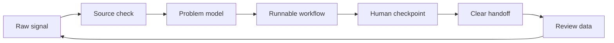

<p align="center">
  
</p>

<p align="center">
  <a href="#activity-arcade">Activity arcade</a> |
  <a href="#workflow-console">Workflow console</a> |
  <a href="#system-map">System map</a> |
  <a href="#toolbox">Toolbox</a> |
  <a href="#selected-builds">Selected builds</a>
</p>

## Activity Arcade

<p align="center">
  <picture>
    <source media="(prefers-color-scheme: dark)" srcset="https://raw.githubusercontent.com/Adkid-Zephyr/Adkid-Zephyr/output/github-contribution-grid-snake-dark.svg">
    <source media="(prefers-color-scheme: light)" srcset="https://raw.githubusercontent.com/Adkid-Zephyr/Adkid-Zephyr/output/github-contribution-grid-snake.svg">
    
  </picture>
</p>

<p align="center">
  <sub>The contribution snake is generated by GitHub Actions and refreshed automatically.</sub>
</p>

## Workflow Console

<table>
  <tr>
    <td width="33%" valign="top">
      <details open>
        <summary><b>01. Sense</b></summary>
        <br>
        Separate proof from heat. Keep the source trail visible and make uncertainty useful.
      </details>
    </td>
    <td width="33%" valign="top">
      <details open>
        <summary><b>02. Shape</b></summary>
        <br>
        Turn fuzzy signals into a first screen, next action, feedback point, and smallest useful version.
      </details>
    </td>
    <td width="33%" valign="top">
      <details open>
        <summary><b>03. Ship</b></summary>
        <br>
        Package prompts, scripts, docs, pages, and handoffs so the next person can use them without a meeting.
      </details>
    </td>
  </tr>
  <tr>
    <td width="33%" valign="top">
      <details>
        <summary><b>Source Scoring</b></summary>
        <br>
        A facts first loop: verify the input, mark the risk, then decide whether the signal is worth shaping.
      </details>
    </td>
    <td width="33%" valign="top">
      <details>
        <summary><b>Interface Pass</b></summary>
        <br>
        The output should show a clear entrance, visible state, and obvious exit before it tries to look polished.
      </details>
    </td>
    <td width="33%" valign="top">
      <details>
        <summary><b>Review Memory</b></summary>
        <br>
        Useful systems keep a trail: what changed, why it changed, and what should be checked next time.
      </details>
    </td>
  </tr>
</table>

## System Map



```text
research -> prototype -> interface -> feedback -> iteration
```

## Toolbox

<p align="center">
  
  
  
  
  
</p>

```text
agent workflows     source scoring      docs as interface
human checkpoints   content systems     small automations
```

## Selected Builds

<table>
  <tr>
    <td width="50%" valign="top">
      <a href="https://github.com/Adkid-Zephyr/XHS_workflowagent"><b>XHS Workflow Agent</b></a>
      <br><br>
      A human-in-the-loop workflow package for AI trend radar, source scoring, content handoff, and review loops.
      <br><br>
      <sub>Signals -> scoring -> draft pack -> manual publish gate -> review memory</sub>
    </td>
    <td width="50%" valign="top">
      <b>Profile Lab</b>
      <br><br>
      This page is built like a small interface: animated header, contribution snake, collapsible panels, anchors, and a system map.
      <br><br>
      <sub>If the shape works, the README should feel clickable before it explains itself.</sub>
    </td>
  </tr>
</table>

## Quiet Signals

<details>
<summary><b>How I decide whether something is worth building</b></summary>
<br>
A useful thing usually has a visible input, a short path to value, a clean handoff, and a way to learn from what happened after it shipped.
</details>

<details>
<summary><b>What I avoid</b></summary>
<br>
Opaque automation, fake certainty, dead-end demos, and interfaces that look finished before the workflow is real.
</details>

<br>

<p align="center">
  <sub>Clear inputs. Sharp edges. Short loops. Useful outputs.</sub>
</p>
