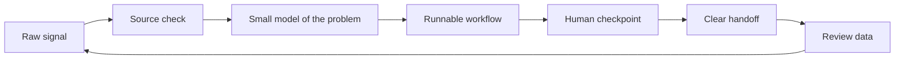

<p align="center">
  
</p>

<p align="center">
  <a href="#open-the-system">Open the system</a> |
  <a href="#live-panels">Live panels</a> |
  <a href="#toolbox">Toolbox</a> |
  <a href="#selected-builds">Selected builds</a>
</p>

## Open The System

I like turning fuzzy signals into tools people can actually use.

Not a showroom. More like a working lab:

```text
research -> prototype -> interface -> feedback -> iteration
```

<details open>
<summary><b>Click to view the loop</b></summary>



</details>

## Live Panels

<table>
  <tr>
    <td width="50%" valign="top">
      <details open>
        <summary><b>01. Sensing</b></summary>
        <br>
        Separate proof from heat. Keep the source trail visible. Make uncertainty useful instead of hiding it.
      </details>
    </td>
    <td width="50%" valign="top">
      <details>
        <summary><b>02. Shaping</b></summary>
        <br>
        Turn a rough idea into a path: first screen, next action, feedback point, and the smallest useful version.
      </details>
    </td>
  </tr>
  <tr>
    <td width="50%" valign="top">
      <details>
        <summary><b>03. Building</b></summary>
        <br>
        Scripts, prompts, docs, pages, and workflows that can be reused without needing a meeting first.
      </details>
    </td>
    <td width="50%" valign="top">
      <details>
        <summary><b>04. Polishing</b></summary>
        <br>
        Trim the sharp edges. Give the next person a clear entrance, a visible state, and an obvious exit.
      </details>
    </td>
  </tr>
</table>

## Toolbox

<p align="center">
  
  
  
  
  
</p>

```text
agent workflows     source scoring      docs as interface
human checkpoints   content systems     small automations
```

## Selected Builds

<table>
  <tr>
    <td width="50%" valign="top">
      <a href="https://github.com/Adkid-Zephyr/XHS_workflowagent"><b>XHS Workflow Agent</b></a>
      <br><br>
      A human-in-the-loop workflow package for AI trend radar, source scoring, content handoff, and review loops.
      <br><br>
      <sub>Signals -> scoring -> draft pack -> manual publish gate -> review memory</sub>
    </td>
    <td width="50%" valign="top">
      <b>Profile Lab</b>
      <br><br>
      This page is built as a small interface: animated header, collapsible panels, route-like anchors, and a system map.
      <br><br>
      <sub>If the shape works, the README should feel clickable before it explains itself.</sub>
    </td>
  </tr>
</table>

## Quiet Signals

<details>
<summary><b>How I decide whether something is worth building</b></summary>
<br>
A useful thing usually has a visible input, a short path to value, a clean handoff, and a way to learn from what happened after it shipped.
</details>

<details>
<summary><b>What I keep in the loop</b></summary>
<br>
Source quality, user intent, friction, failure modes, and the small details that make a tool feel safe to try.
</details>

<details>
<summary><b>What I avoid</b></summary>
<br>
Opaque automation, fake certainty, dead-end demos, and interfaces that look finished before the workflow is real.
</details>

<br>

<p align="center">
  <sub>Clear inputs. Sharp edges. Short loops. Useful outputs.</sub>
</p>
