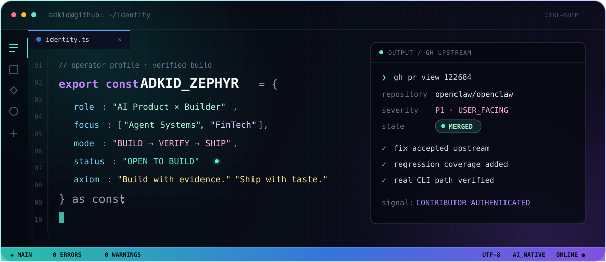
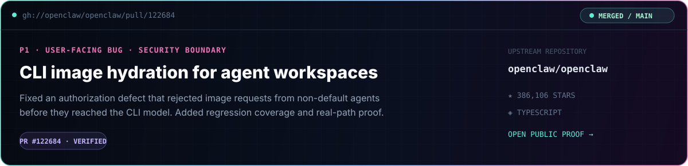
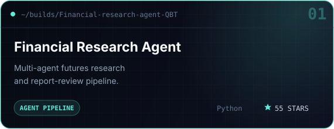
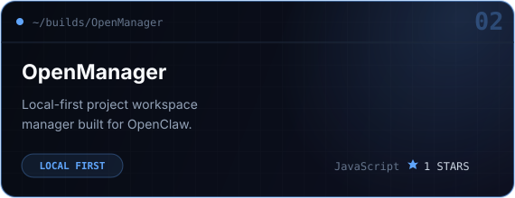
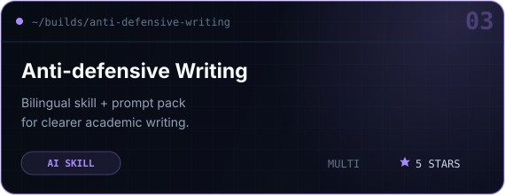
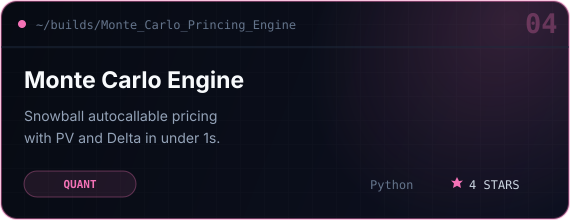
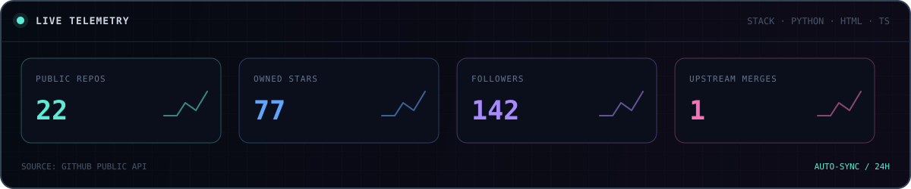

  <samp>
    <a href="#upstream-signal">OSS_SIGNAL</a> ·
    <a href="#ship-log">SHIP_LOG</a> ·
    <a href="#telemetry">TELEMETRY</a> ·
    <a href="https://github.com/Adkid-Zephyr?tab=repositories">ALL_REPOS</a>
  </samp>

  

  
  
  
  

  <samp>AI Product Manager × Builder — turning ambiguous problems into systems that ship.</samp>

## 01 // UPSTREAM_SIGNAL

<samp>Changes that survived review and landed in someone else's <code>main</code>.</samp>

<!-- OSS-CONTRIBUTIONS:START -->

<!-- OSS-CONTRIBUTIONS:END -->

## 02 // SHIP_LOG

<samp>Selected systems, experiments, and products from my local universe.</samp>

  
  

  
  

## 03 // TELEMETRY

<samp>Public signal, regenerated from GitHub every day.</samp>

  

 

  <samp>
    EOF · BUILD_WITH_EVIDENCE · SHIP_WITH_TASTE
  </samp>

