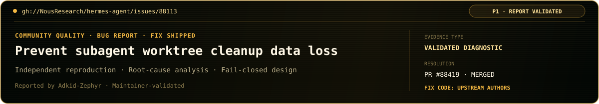

  

## UPSTREAM_SIGNAL

<samp>Public upstream impact, separated by evidence type.</samp>

### MERGED_CODE

<samp>Code authored by Adkid-Zephyr and merged into an upstream default branch.</samp>

<!-- OSS-CONTRIBUTIONS:START -->

<!-- OSS-CONTRIBUTIONS:END -->

### VALIDATED_DIAGNOSTICS

<samp>Maintainer-validated diagnostic work whose fix shipped upstream; distinct from authored code.</samp>

<samp>
  <a href="https://github.com/NousResearch/hermes-agent/issues/88113">Issue #88113</a> ·
  <a href="https://github.com/NousResearch/hermes-agent/issues/88113#issuecomment-5316817959">Maintainer confirmation</a> ·
  <a href="https://github.com/NousResearch/hermes-agent/pull/88419">Fixed in PR #88419</a>
</samp>
