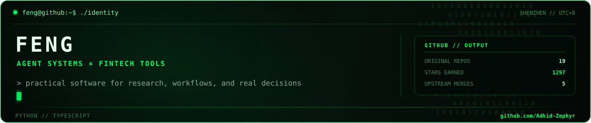

  

#### Open source

- **[OpenClaw](https://github.com/openclaw/openclaw)** — [P1 code contribution](https://github.com/openclaw/openclaw/pull/122684): CLI image hydration for agent workspaces, merged into upstream `main`.
- **[Hermes Agent](https://github.com/NousResearch/hermes-agent)** — [P1 diagnostic contribution](https://github.com/NousResearch/hermes-agent/issues/88113): reproduced and traced worktree-cleanup data loss; [maintainer-validated](https://github.com/NousResearch/hermes-agent/issues/88113#issuecomment-5316817959), then [fixed upstream](https://github.com/NousResearch/hermes-agent/pull/88419) by project contributors.
- **[OpenHands](https://github.com/OpenHands/OpenHands)** — [Open fix PR #16841](https://github.com/OpenHands/OpenHands/pull/16841): fixes [a triaged medium-priority bug](https://github.com/OpenHands/OpenHands/issues/16839) causing timeout-listener accumulation on reused keep-alive sockets; awaiting maintainer review and merge.
