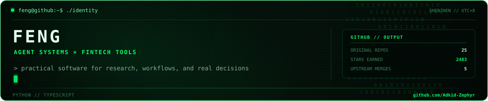

  

#### Open source

- **[OpenClaw](https://github.com/openclaw/openclaw)**  — **2 authored contributions merged into upstream `main`**: [P1 code #122684](https://github.com/openclaw/openclaw/pull/122684) hydrated CLI images from agent workspaces; [CLI docs #122632](https://github.com/openclaw/openclaw/pull/122632) completed the config and backup command tree, merged by [Peter Steinberger (@steipete)](https://github.com/steipete).
- **[Solana Pay](https://github.com/solana-foundation/pay)**   — [Authored fix #481 merged into `solana-foundation/pay:main`](https://github.com/solana-foundation/pay/pull/481): enabled v0 payment validation with address lookup tables, backed by 15 regressions and a 2,309-test workspace validation.
- **[Hermes Agent](https://github.com/NousResearch/hermes-agent)**  — [P1 diagnostic contribution](https://github.com/NousResearch/hermes-agent/issues/88113): reproduced and traced worktree-cleanup data loss; [maintainer-validated](https://github.com/NousResearch/hermes-agent/issues/88113#issuecomment-5316817959), then [fixed upstream](https://github.com/NousResearch/hermes-agent/pull/88419) by project contributors.
- **[Laya](https://github.com/NandhaKishorM/laya)**  — **2 authored contributions merged into upstream `main`**: [#98](https://github.com/NandhaKishorM/laya/pull/98) cut default checkpoint downloads by 1.53 GB (64.3%); [owner-invited research #193](https://github.com/NandhaKishorM/laya/pull/193) added a reproducible 64-case Chinese workflow benchmark with 768 timed responses and bilingual results.
- **[Cordis](https://github.com/cordiverse/cordis)**  — **Underlying plugin framework of [DeepSeek Harness](https://github.com/deepseek-ai/deepseek-harness)**; [validated diagnostic contribution #105](https://github.com/cordiverse/cordis/issues/105): reported and reproduced a Node 24 loader API misclassification, [maintainer-confirmed](https://github.com/cordiverse/cordis/issues/105#issuecomment-5519941701) and fixed on upstream `main` in [`2df12b5`](https://github.com/cordiverse/cordis/commit/2df12b5fa2d2dba34df1cdb1713c539c17f092af) by upstream authors.
- **[Quotio](https://github.com/nguyenphutrong/quotio)**  — [Authored fix #518 merged into upstream `master`](https://github.com/nguyenphutrong/quotio/pull/518): replaced brittle fixed-delay proxy startup with bounded health polling and six deterministic regressions; merged by [Trong Nguyen (@nguyenphutrong)](https://github.com/nguyenphutrong).
- **[Apache OpenServerless (Incubating)](https://github.com/apache/openserverless)**   — **Early contributor to its official [MCP server](https://github.com/apache/openserverless-mcp)**: authored [#11](https://github.com/apache/openserverless-mcp/pull/11) and [#12](https://github.com/apache/openserverless-mcp/pull/12), hardening generated-endpoint validation and restoring action-result delivery to MCP clients.
